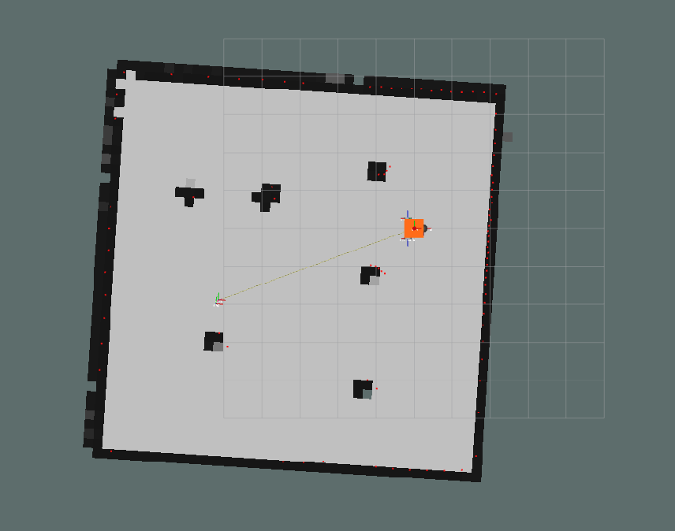

# slam_2d

A 2d grid-based FastSLAM implementation (i.e. Rao-Blackwellized particle filter). Likelihood fields are used as the measurement model p(zt|xt, m).

## Launch

The launch file runs the SLAM node alongside the wheelybot simulation.

```sh
ros2 launch slam_2d slam.launch.py
```

## Results



## References

FastSLAM and supporting algorithms:

* http://www.probabilistic-robotics.org/

Squared eucliden distance field calculation:

* https://cs.brown.edu/people/pfelzens/papers/dt-final.pdf
* https://prideout.net/blog/distance_fields/

